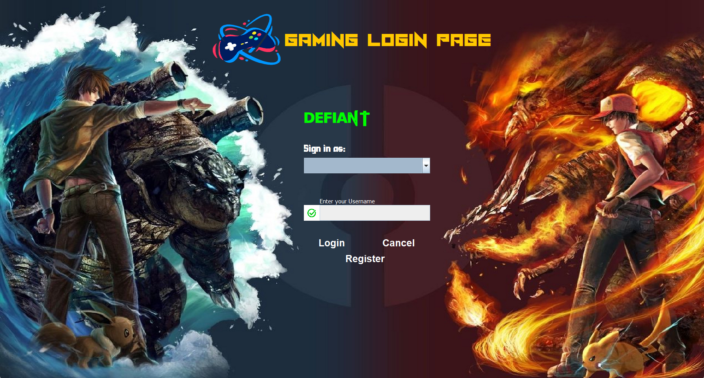
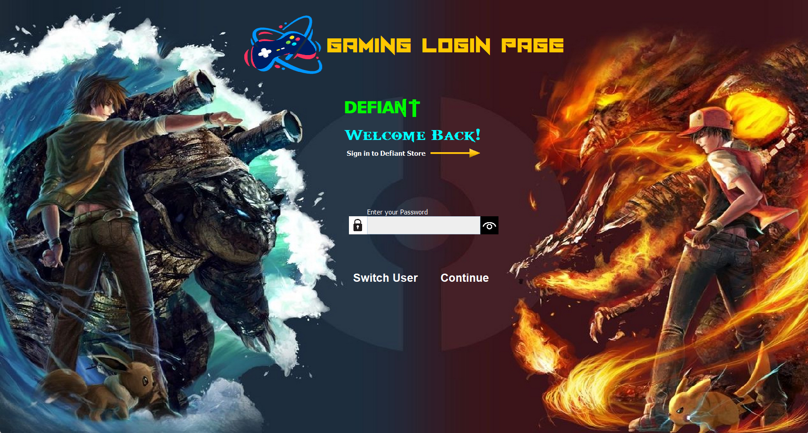

# Login Page

## Introduction

This is just a basic Login Page written in Java Language. 
Needed where..?? For those who all are working for Desktop-based Applications, and they want a login page to be embedded in their application, then this might be your choice.

  
Have a look at its design

  
  
  

## Steps to Start with:

- Firstly install Intellij IDE from the official [jetbrains website.](https://www.jetbrains.com/idea/download/#section=windows) 

NOTE: If you are a college student and have your college mail id then use it and download the ultimate version for free, else use the normal one it will also work (at least for this project).

- Then complete all its setup related part (like setting up the environment variable and all...).
- Now since the setup is done, so simply clone this project in your system and run the "MainPage.java" file from the IDE itself and BOOM...💥💥 You got your Login Page right in front of you.
- Now do whatever you want adding it in any of your existing project, etc. etc. , basically just play around with it.

### Happy Coding...!! 👨🏽‍💻👨🏽‍💻